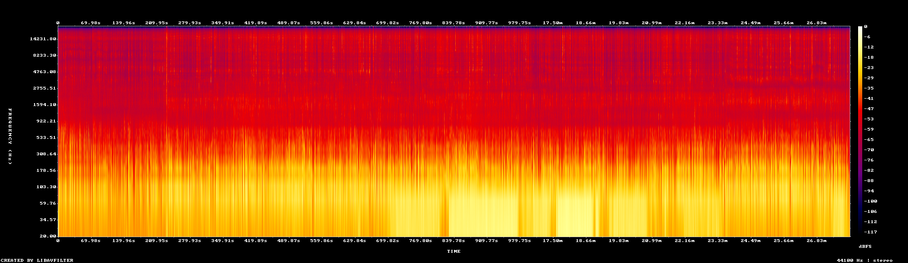
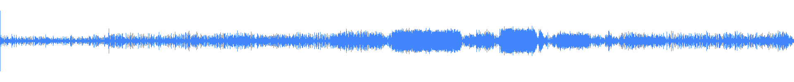

# 🎙️ AudioBench

**Offline AI audio toolkit** — transcribe, search, chat, visualize, and speak.

Turn any audio file into a searchable knowledge base that runs entirely on your machine.

> No API keys required · No cloud · No data leaves your laptop

**Python 3.10+** · **MIT License** · **CPU-optimized** (`int8` quantization)

---

## What You Get in One Command

| | Capability | Command | What it does |
|---|---|---|---|
| 🎤 | **Transcribe** | `audiobench transcribe file.m4a` | Offline speech-to-text with word timestamps |
| 🔴 | **Live** | `audiobench listen` | Real-time microphone transcription |
| 🗣️ | **Speakers** | `--diarize` | Identify who said what |
| 💬 | **Chat** | `audiobench chat 3` | Ask questions about any transcript |
| 🔍 | **Search** | `audiobench search "keyword"` | Full-text search across all history |
| 📊 | **Visualize** | `audiobench inspect file.m4a` | Waveform + spectrogram in one shot |
| 🔊 | **Speak** | `audiobench speak "Hello"` | Text-to-speech (offline Piper TTS) |
| 🔧 | **Analyze** | `audiobench analyze file.m4a` | Loudness, silence regions, quality |

---

## See AudioBench in Action

### 📊 Audio Spectrogram
> `audiobench inspect recording.flac`



### 🌊 Waveform
> `audiobench inspect recording.flac`



### 🗣️ Speaker Diarization
> `audiobench transcribe conversation.m4a --diarize --engine gemini`

```
[Speaker 1]: So what do you think about the project?
[Speaker 2]: Honestly it's really impressive.
[Speaker 1]: We should publish it.
[Speaker 2]: Let's do it this week.
```

---

## Quick Start

```bash
# 1. Clone & enter
git clone https://github.com/de3f4ault/audiobench.git
cd audiobench

# 2. Install
make install        # creates venv + installs deps
source venv/bin/activate

# 3. Transcribe
audiobench transcribe meeting.m4a
```

The first run downloads the model (~1.5 GB) to `~/.audiobench/models/`. Subsequent runs start faster.

---

## Installation

### Using Make (recommended)

```bash
make install          # Base install (transcription only)
make dev              # Full install (all extras: docs, dev tools, TTS, streaming, AI)
```

### Manual

```bash
python -m venv venv
source venv/bin/activate    # or: source venv/bin/activate.fish
pip install -e .
```

### System Dependency

**FFmpeg** is required for audio conversion:

```bash
# Arch
sudo pacman -S ffmpeg

# Ubuntu/Debian
sudo apt install ffmpeg

# macOS
brew install ffmpeg
```

---

## CLI Commands

### `transcribe` — Core Transcription

```bash
# Print transcript to terminal
audiobench transcribe meeting.m4a

# Save as SRT subtitle file
audiobench transcribe meeting.m4a -f srt

# Auto-detect format from output filename
audiobench transcribe meeting.m4a -o notes.srt

# Batch: transcribe all m4a files, save to ./out/
audiobench transcribe *.m4a -o ./out/

# Fast preset (less accurate, ~2x speed)
audiobench transcribe --fast lecture.mp3

# Accurate preset (slower, best quality)
audiobench transcribe --accurate interview.wav

# Enhance + trim silence + denoise in one pass
audiobench transcribe --enhance --trim --denoise meeting.m4a

# Pipe-friendly raw output
audiobench transcribe -q meeting.m4a | grep "keyword"

# Inspect file metadata and filter chain without transcribing
audiobench transcribe --check --enhance --denoise recording.m4a
```

#### Options

| Flag | Short | Description |
|------|-------|-------------|
| `--format` | `-f` | Output format: `txt`, `srt`, `vtt`, `json` |
| `--output` | `-o` | Output path (file or directory) |
| `--language` | `-l` | Language code (e.g. `en`, `sw`). Default: auto-detect |
| `--model` | `-m` | Model: `tiny`, `base`, `small`, `medium`, `large-v3`, `large-v3-turbo` |
| `--fast` | |  Fast preset: beam=1, batch=8 |
| `--balanced` | |  Balanced preset: beam=3, batch=4 (default) |
| `--accurate` | |  Accurate preset: beam=5, sequential |
| `--prompt` | | Guide model with context (e.g. `"Conversation in Swahili and English"`) |
| `--enhance` | | Spectral noise reduction (highpass + afftdn) + EBU R128 loudness normalization |
| `--trim` | | Remove leading/trailing silence before transcription |
| `--denoise` | | AI noise reduction via RNNoise neural network (downloads model on first use) |
| `--filter` | | Custom ffmpeg audio filter graph |
| `--no-cache` | | Re-transcribe even if cached |
| `--no-timestamps` | | Disable word-level timestamps |
| `--quiet` | `-q` | Raw output only (for piping) |
| `--check` | | Show file metadata and filter chain, no transcription |

> **Smart filter chain**: When `--denoise` is active, it supersedes the spectral denoiser in `--enhance` (no double denoising). Filters are always applied in the optimal order: `highpass → denoise → trim → loudnorm`. Use `--check` to preview the exact filter chain before processing.

> **First-run note**: `--denoise` downloads the RNNoise model (~293 KB) on first use from GitHub to `~/.audiobench/models/rnnoise/`. Subsequent runs use the cached model.

---

### `repl` — Interactive Shell

Drop into a context-aware interactive session with dot-commands, history navigation, and full access to all CLI commands.

```bash
audiobench repl
```

Inside the REPL:

```
audiobench> history                    # List transcriptions
audiobench> show 3                     # View transcript #3 → sets context
audiobench [#3 meeting.m4a]> .stats    # Quick stats (context-aware)
audiobench [#3 meeting.m4a]> .segments # Show timestamped segments
audiobench [#3 meeting.m4a]> .find "keyword" # Search within transcript
audiobench [#3 meeting.m4a]> .play     # Play source audio
audiobench [#3 meeting.m4a]> .edit     # Open in $EDITOR
audiobench [#3 meeting.m4a]> .next     # Jump to next transcript
audiobench [#3 meeting.m4a]> .close    # Clear context
audiobench> .help                      # Show all dot-commands
```

#### Dot-Commands

| Command | Description |
|---------|-------------|
| `.stats` | Word count, duration, language, model |
| `.show` | Full transcript text |
| `.segments` | Timestamped segments |
| `.info` | Detailed metadata (codec, bitrate, model settings) |
| `.find "text"` | Search within the active transcript |
| `.play` | Play audio (`ffplay`) |
| `.play 01:25` | Play from timestamp |
| `.edit` | Edit transcript in `$EDITOR`, saves to DB |
| `.path` | Show source audio file path |
| `.open` | Open audio in system default player |
| `.next` / `.prev` | Navigate between transcripts |
| `.recent` | Show 5 most recent transcriptions |
| `.search "text"` | Global search across all transcripts |
| `.close` | Clear current context |
| `.help` | List all dot-commands |

---

### `listen` — Real-Time Transcription (Live STT)

Transcribe microphone input in real-time. Audio is processed continuously using voice activity detection (VAD). Results are automatically saved to your history database.

```bash
# Basic live transcription
audiobench listen

# Force a specific language (faster & more accurate if known)
audiobench listen --language en

# Use the fastest model (lower accuracy)
audiobench listen --model tiny

# Also save transcript to a text file
audiobench listen --save meeting.txt
```

#### Live STT Tuning

- **Cadence**: Text appears every ~4 seconds of continuous speech or after a 0.4s pause.
- **Model**: Defaults to `base` (tuned with 4 CPU threads for ~0.5x real-time speed).
- **History**: Live sessions appear in `audiobench history` as "🎤 Live session" and can be searched or spoken via TTS.

---

### `speak` — Text-to-Speech (TTS)

Speak text, files, or past transcripts aloud using the offline Piper TTS engine. High-quality voices are downloaded on-demand.

```bash
# Speak text directly
audiobench speak "Hello world"

# Speak a text file
audiobench speak notes.txt

# Speak a previous transcript from history
audiobench speak --id 3

# Save TTS output to a WAV file instead of playing
audiobench speak "Hello" -o greeting.wav

# Use a specific high-quality voice
audiobench speak --voice en_US-lessac-high "Hello world"
```

#### Recommended High-Quality Voices

- `en_US-lessac-high` (Female, Clear & Natural)
- `en_US-ryan-high` (Male, Clear & Articulate)
- `en_US-ljspeech-high` (Female, Audiobook style)

---

### `history` — View Past Transcriptions

```bash
audiobench history            # Show last 20 transcriptions
audiobench history --limit 50 # Show last 50
```

### `search` — Full-Text Search

```bash
audiobench search "keyword"
audiobench search "yoga" --limit 5
```

### `export` — Re-export to Another Format

```bash
audiobench export 3 -f vtt           # Export ID #3 as VTT
audiobench export 3 -f srt -o sub/   # Save to sub/ directory
```

### `show` — View a Transcription

```bash
audiobench show 3              # View transcript #3 with metadata
```

### `delete` — Remove from History

```bash
audiobench delete 3          # Delete transcription #3
audiobench delete --all      # Delete all history
```

### `download` — Pre-download Models

```bash
audiobench download large-v3-turbo   # Download for offline use
audiobench download small            # Smaller, faster model
```

### `info` — System Info & Settings

```bash
audiobench info
```

Shows: Python version, device (CPU/CUDA), model, compute type, storage paths, database size, and all configuration values.

### `chat` — AI Chat with Transcript Context

```bash
audiobench chat                # Start AI chat session
audiobench chat 3              # Chat with transcript #3 as context
```

Full-featured AI chat with readline history, multi-line input, `/export`, `/retry`, and markdown rendering.

### `vocab` — Word Frequency Analysis

```bash
audiobench vocab 3                      # Top 30 words from transcript #3
audiobench vocab 3 --top 50             # Top 50 words
audiobench vocab 3 --min-length 5       # Only words ≥5 chars
audiobench vocab 3 --format json        # JSON output
audiobench vocab 3 --format csv         # CSV for spreadsheets
```

### `preset` — Named Configuration Presets

Save and reuse transcription settings:

```bash
audiobench preset create meeting --model large-v3 --speed accurate --enhance
audiobench preset create podcast --language en --format srt
audiobench preset list
audiobench preset show meeting
audiobench preset delete meeting

# Use a preset when transcribing
audiobench transcribe file.m4a --preset meeting
```

### `doctor` — System Health Check

```bash
audiobench doctor
```

Checks: ffmpeg, ffprobe, faster-whisper, piper-tts, ollama, CUDA availability, disk space, and database connectivity.

### `status` — Usage Statistics

```bash
audiobench status
```

Shows database size, transcription count, total hours processed, model cache size, and voice cache size.

### `cleanup` — Clean Old Data

```bash
audiobench cleanup --older-than 30d        # Delete old transcriptions
audiobench cleanup --cache                  # Remove model cache
audiobench cleanup --temp                   # Remove temp files
audiobench cleanup --older-than 7d --dry-run # Preview what would be deleted
```

### `install-completion` — Shell Tab Completions

```bash
audiobench install-completion bash
audiobench install-completion zsh
audiobench install-completion fish
```

---

### `analyze` — Audio Intelligence Report

Inspect loudness, silence, and quality characteristics of any audio file.

```bash
audiobench analyze meeting.m4a
```

Shows integrated LUFS, loudness range, true peak, silence regions, and recommends which flags to use (`--trim`, `--enhance`, `--denoise`).

### `convert` — Audio Format Conversion

```bash
audiobench convert recording.m4a -o recording.mp3
audiobench convert recording.wav -o recording.opus --bitrate 48k
audiobench convert lecture.mp3 -o fast.mp3 --speed 1.5      # Rubberband time-stretch
```

Smart codec defaults: MP3 192kbps, Opus 64kbps, OGG q5, FLAC lossless.

### `merge` — Concatenate Audio Files

```bash
audiobench merge part1.wav part2.wav -o full.wav
```

### `inspect` — Visual Analysis

```bash
audiobench inspect recording.m4a                    # Waveform + spectrogram
audiobench inspect recording.m4a --waveform         # Waveform only
audiobench inspect recording.m4a --spectrum          # Spectrogram only
audiobench inspect recording.m4a -o ./images/        # Save to directory
```

Generates PNG images of the audio waveform and/or spectrogram.

---

## Plugin System

Extend AudioBench with custom commands by placing Python files in `data/plugins/`.

```python
# data/plugins/my_tool.py
import click

@click.command()
@click.argument("text")
def shout(text):
    """Shout some text."""
    click.echo(text.upper())

def register(cli):
    cli.add_command(shout)
```

Plugins are loaded automatically on startup. If no `register()` function is defined, Click commands at the module level are auto-registered.

---

## Output Formats

| Format | Extension | Use Case |
|--------|-----------|----------|
| `txt` | `.txt` | Plain text, default |
| `srt` | `.srt` | Subtitles (most video players) |
| `vtt` | `.vtt` | Web subtitles (HTML5 `<track>`) |
| `json` | `.json` | Programmatic access, word-level data |

---

## Configuration

Settings are loaded in priority order:

1. **CLI flags** (highest priority)
2. **Environment variables** (prefixed with `AUDIOBENCH_`)
3. **`.env` file** in project root
4. **Defaults**

Copy `.env.example` to get started:

```bash
cp .env.example .env
```

### Key Settings

| Variable | Default | Description |
|----------|---------|-------------|
| `AUDIOBENCH_MODEL_NAME` | `large-v3-turbo` | Whisper model size |
| `AUDIOBENCH_DEVICE` | `auto` | `auto`, `cpu`, `cuda` |
| `AUDIOBENCH_COMPUTE_TYPE` | `int8` | `int8` (CPU), `float16` (CUDA), `float32` |
| `AUDIOBENCH_LANGUAGE` | *(empty)* | Auto-detect. Set to `en`, `sw`, `fr`, etc. |
| `AUDIOBENCH_SPEED_PRESET` | `balanced` | `fast`, `balanced`, `accurate` |
| `AUDIOBENCH_BATCH_SIZE` | `4` | Batch inference size (1–16) |
| `AUDIOBENCH_CPU_THREADS` | `0` | CPU threads (`0` = auto-detect) |
| `AUDIOBENCH_OUTPUT_FORMAT` | `txt` | Default output format |
| `AUDIOBENCH_LOG_LEVEL` | `WARNING` | `DEBUG`, `INFO`, `WARNING`, `ERROR` |

---

## Speed Presets

| Preset | Beam Size | Batch Size | Temperature | Condition on Previous | Use Case |
|--------|-----------|------------|-------------|----------------------|----------|
| `--fast` | 1 | 8 | 0 (no fallback) | No | Quick drafts, long recordings |
| `--balanced` | 3 | 4 | Fallback chain | No | Daily use (default) |
| `--accurate` | 5 | 1 (sequential) | Fallback chain | Yes | Important recordings |

---

## Directory Layout

```
audiobench/                    ← Project root
├── data/                      ← Project-local data (gitignored)
│   ├── transcriptions.db      ← SQLite database (history, search)
│   ├── plugins/               ← User plugins (Python files)
│   ├── presets/               ← Named configuration presets (TOML)
│   ├── logs/                  ← Application logs
│   ├── sessions/              ← Live transcription sessions
│   └── repl_history           ← REPL command history
├── .env                       ← Your configuration (gitignored)
└── .env.example               ← Configuration template

~/.audiobench/                 ← Shared resources (multi-GB, reused across projects)
├── models/                    ← Whisper models (~1.5 GB each)
│   └── rnnoise/               ← RNNoise neural denoise model (~293 KB)
└── voices/                    ← Piper TTS voice models
```

---

## Project Structure

```
src/audiobench/
├── core/                           ← Infrastructure
│   ├── settings.py                 ← Pydantic settings (env vars, .env, defaults)
│   ├── logger_factory.py           ← Logging setup
│   ├── db_base.py                  ← SQLAlchemy DeclarativeBase
│   ├── db_engine.py                ← Engine + init_db
│   ├── db_session.py               ← Session factory
│   └── error_types.py              ← Custom exceptions
│
├── transcribe/                     ← Transcription pipeline
│   ├── transcriber.py              ← Pipeline orchestrator
│   ├── audio_converter.py          ← FFmpeg wrapper (filters, conversion)
│   ├── audio_filters.py            ← Text quality filters
│   ├── transcription_result.py     ← Pydantic models (Segment, Transcript, Word)
│   └── engines/
│       ├── engine_protocol.py      ← Engine interface
│       ├── engine_registry.py      ← Factory/registry
│       └── whisper_engine.py       ← faster-whisper (batched + sequential)
│
├── chat/                           ← AI chat feature
│   ├── chat_session.py             ← Chat orchestrator
│   ├── chat_store.py               ← DB persistence
│   ├── context_builder.py          ← Prompt templates
│   └── providers/
│       └── ollama_provider.py      ← Ollama backend
│
├── cli/                            ← Presentation layer
│   ├── app.py                      ← Entry point + global flags
│   ├── commands/                   ← Auto-discovered commands
│   │   ├── __init__.py             ← pkgutil auto-discovery
│   │   ├── transcribe.py, audio.py, chat.py, history.py, ...
│   ├── display/                    ← Visual rendering
│   │   ├── theme.py                ← Colors, Rich console, panels
│   │   └── phase_tracker.py        ← Progress display
│   ├── io/                         ← Input/Output handling
│   │   ├── file_collector.py       ← Path resolution, globs, manifests
│   │   └── output_resolver.py      ← Output path, format, collisions
│   ├── plugins/                    ← Plugin system
│   │   ├── loader.py               ← Plugin discovery + loading
│   │   └── custom_group.py         ← Fuzzy command matching
│   └── repl/                       ← Interactive shell
│       ├── __init__.py             ← Main loop
│       ├── session.py, dispatch.py, dot_commands.py, ...
│
├── storage/                        ← Data layer
│   ├── models.py                   ← SQLAlchemy ORM models
│   └── repository.py               ← CRUD operations
│
├── output/                         ← Format writers (txt, srt, vtt, json)
├── streaming/                      ← Live transcription
├── tts/                            ← Text-to-speech (Piper)
└── diarization/                    ← Speaker detection

tests/                              ← Test suite (109 tests)
├── conftest.py                     ← Shared fixtures
├── test_core/                      ← Settings, DB engine
├── test_cli/                       ← Commands, IO, REPL
└── test_storage/                   ← Repository CRUD
```

---

## Make Targets

```bash
make help              # Show all targets
make install           # Install base dependencies
make dev               # Install with dev dependencies (editable)
make test              # Run test suite with coverage
make lint              # Run ruff + mypy
make format            # Auto-format with black + ruff
make clean             # Remove build artifacts
make transcribe FILE=audio.m4a           # Quick transcribe
make transcribe-srt FILE=audio.m4a       # Transcribe → SRT
make translate FILE=audio.m4a            # Translate to English
make history           # View transcription history
make search Q="word"   # Search transcriptions
make info              # Show system info
make download MODEL=large-v3-turbo       # Download model
make listen            # Live microphone transcription
make speak TEXT="Hello"                   # Text-to-speech
make repl              # Launch interactive shell
make doctor            # System health check
make status            # Usage statistics
```

---

## Verbose / Debug Mode

```bash
audiobench -v transcribe meeting.m4a     # Verbose (INFO logs)
audiobench --debug transcribe meeting.m4a # Debug (all logs)
```

---

## Documentation

AudioBench includes a documentation site built with [Zensical](https://zensical.org/).

```bash
# Install docs dependencies (included in `make dev`)
pip install -e ".[docs]"

# Build static docs
make docs

# Serve locally with live reload
make docs-serve

# Stop the docs server
make docs-stop
```

The generated site is output to `site/`.

---

## License

MIT — see [LICENSE](LICENSE) for details.
